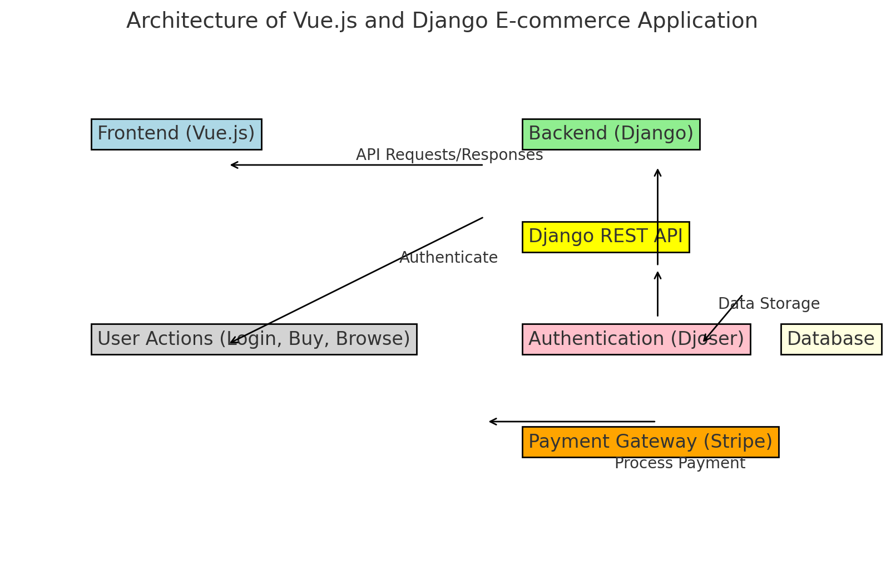

# Project_E-commerce_Website_With_Django_and_Vue

## Techno:

### Django:

	•	Django is a high-level Python web framework that enables rapid development of secure and maintainable websites. It’s built to help you build complex, data-driven web applications quickly and efficiently.
	•	In your project, Django will handle backend logic, database models, and templates for rendering views.

### Django REST Framework (DRF):
	•	Django REST Framework is an extension of Django that simplifies building APIs. It provides tools and components to create RESTful APIs, allowing your frontend (like Vue.js) to communicate with your Django backend using JSON data.
	•	It’s essential for exposing your Django models and logic as web services (APIs).

### Django CORS Headers:
	•	This package allows you to handle CORS (Cross-Origin Resource Sharing) in your Django project.
	•	CORS is important for security, and it controls how your frontend (running on a different domain or port) can interact with your backend. This is necessary when your Vue frontend will communicate with your Django API, which will likely run on different origins during development and deployment.
### Djoser:
	•	Djoser is an authentication library that works with Django REST Framework. It provides a set of views and serializers to handle common authentication features like registration, login, password reset, token-based authentication, etc.
	•	This simplifies implementing user authentication and management in your API.
### Pillow:
	•	Pillow is a Python imaging library used in Django for image processing. It’s commonly used for handling and uploading images (like product photos in your e-commerce site).
	•	Django uses Pillow to manage image fields in models and handle image uploads.
### Stripe:
	•	Stripe is a payment processing platform, and the Stripe package allows you to integrate Stripe’s payment gateway into your Django project.
	•	In your e-commerce site, Stripe will be used to handle payments from users, such as managing checkout, processing credit cards, and handling transactions securely.

### Vue:

	•	Vue.js is a progressive JavaScript framework used for building user interfaces, primarily for single-page applications (SPAs). Here’s what it’s for:

	•	Frontend Framework: Vue.js allows you to build the frontend of your application. It handles the user interface and interactions in the browser.
	•	Reactive Components: It lets you build modular, reusable components that can automatically react to changes in data (reactivity system). This makes building dynamic and responsive user interfaces more efficient.
	•	Integration with Django: Vue will work alongside Django (which handles the backend). It will send requests to the Django REST API (which you create using Django REST Framework), allowing you to fetch and display data (e.g., products, user info) and interact with the backend seamlessly.

In your e-commerce project:

	•	Vue will handle the client-side (what users see and interact with), such as product pages, shopping carts, and checkout forms.
	•	It will communicate with the Django API to retrieve data, process orders, and manage user authentication.

In summary, these packages collectively help you build the backend (Django), expose APIs (DRF), ensure security (CORS), manage user authentication (Djoser), handle images (Pillow), and manage payments (Stripe) for your e-commerce project.

